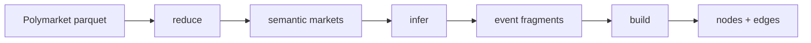

# Architecture

OddsFox Graph is a local pipeline that turns Polymarket WC2026 hourly-odds
parquet into validated graph artifacts.

## Stage diagram

## Stages

1. **reduce** — Collapse hourly rows into semantic market records keyed by
   market / event metadata.
2. **infer** — For each event:
   - apply deterministic topology templates when possible
   - otherwise chunk markets and run structured local LLM extraction
   - write `build/fragments/<event_id>.json` (path-safe `event_id` only)
3. **build** — Optionally inject the official WC2026 bracket, resolve fragment
   nodes into canonical IDs, validate ontology patterns, apply confidence
   filters, and export parquet / JSON.
4. **validate** — Re-check exported artifacts for consistency.

## Performance note

Local LLM inference dominates end-to-end wall-clock time. Deterministic topology
covers most WC2026 events; residual LLM work is the expensive path. Prefer
`--llm-backend server --concurrency N` for full-dataset runs.

## See also

- [Deterministic topology](../guides/deterministic-topology.md)
- [Official bracket](../guides/official-bracket.md)
- [Entity resolution](entity-resolution.md)
- [Running the pipeline](../guides/running-the-pipeline.md)
