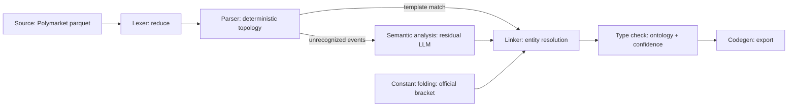
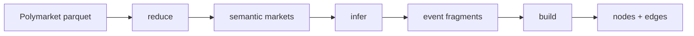

# Architecture

OddsFox Graph is a local **Logical Knowledge Graph Compiler** for prediction
markets. It turns Polymarket WC2026 hourly-odds parquet into a validated
logical knowledge graph, exported as `nodes.parquet` / `edges.parquet`.

The compiler framing is an analogy for how stages transform source market
records into typed graph artifacts. The CLI still exposes a pipeline
(`reduce` → `infer` → `build` → `validate`); the table below maps those stages
to compiler phases.

## Compiler phases

| Compiler phase | OddsFox Graph stage | Module | Output |
| --- | --- | --- | --- |
| Lexing / normalization | `reduce` | `oddsgraph/reduce.py` | `semantic_markets.parquet` |
| Parsing (deterministic grammar) | Deterministic topology | `oddsgraph/deterministic.py`, `oddsgraph/topology.py` | Template-matched fragments |
| Constant folding | Official bracket injection | `oddsgraph/bracket.py` | Curated FIFA schedule fragment |
| Semantic analysis (ambiguous input) | Residual LLM extraction | `oddsgraph/infer.py`, `oddsgraph/prompts.py`, `oddsgraph/llm*.py` | `fragments/<event_id>.json` |
| Linking | Entity resolution | `oddsgraph/resolution.py` | Canonical node/edge IDs |
| Type checking / diagnostics | Ontology validation + confidence filter | `oddsgraph/ontology.py`, `oddsgraph/graphbuild.py` | `rejected_edges.parquet` |
| Code generation | Export | `oddsgraph/export.py` | `nodes.parquet` + `edges.parquet` |

## Phase diagram

Deterministic parsing covers most events; unrecognized events take the residual
LLM semantic-analysis path. Official bracket injection joins at `build`. All
paths converge at the linker.

## CLI stage view

The same flow as concrete CLI commands:

1. **reduce** — Collapse hourly rows into semantic market records keyed by
   market / event metadata (lexing / normalization).
2. **infer** — For each event:
   - apply deterministic topology templates when possible (parsing)
   - otherwise chunk markets and run structured local LLM extraction
     (semantic analysis)
   - write `build/fragments/<event_id>.json` (path-safe `event_id` only)
3. **build** — Optionally inject the official WC2026 bracket (constant
   folding), resolve fragment nodes into canonical IDs (linking), validate
   ontology patterns and apply confidence filters (type checking), then export
   parquet / JSON (code generation).
4. **validate** — Re-check exported artifacts for consistency.

## Performance note

Local LLM inference dominates end-to-end wall-clock time. Deterministic
topology covers most WC2026 events; residual LLM work is the expensive path.
Backend choice (`inprocess` / `server` / `mlx`), outlines constrained decoding,
and MLX setup are documented in
[Inference backends](../guides/inference-backends.md).

## See also

- [Glossary](glossary.md)
- [Deterministic topology](../guides/deterministic-topology.md)
- [Official bracket](../guides/official-bracket.md)
- [Inference backends](../guides/inference-backends.md)
- [Entity resolution](entity-resolution.md)
- [Running the pipeline](../guides/running-the-pipeline.md)
